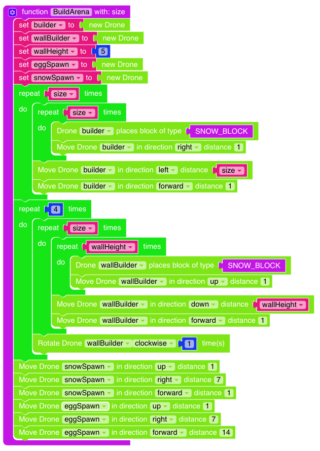

# Paintball! 

I denne oppgaven skal vi lage et multiplayer minigame! Spillet ligner litt på
helt vanlig paintball, men vi spiller med egg og snøballer. NB: Her ligger det
stortsett bare kode og ingen instruksjoner. 

# Steg 1: Bygg en arena! 

Det første vi må gjøre er å bygge en arena vi kan spille på. Bygg en helt flat
firkant av snø! 

 

Men vi trenger jo vegger også! Lag en `wallBuilder` drone som setter opp vegger
rundt banen vår. 

 

# Steg 2: La spillere bli med! 

Nå trenger vi litt kode som lager Egg- og Snøballag av spillere som blir med!
Først legger vi til spillere. Hver spiller skriver `join` for å bli med og
legges da til i et lag. 

 

# Steg 3: Gi spillerne våpen når spillet startes! 

Så når vi skriver `start` starter vi spillet og gir alle spillerene våpen. 

# Steg 4: Lag spawnpoints. 
Når spillet starter må vi flytte alle spillerne til arenaen vår. Lagene må
starte på hver sin side. 

Lag to nye variabler `eggSpawn` og `snowSpawn` og flytt de til hver sin side av
arenaen. 

I løkkene hvor vi deler ut våpen teleporterer vi spillerne våre. 

# Steg 5: Tell poeng når spillere bli truffet av snøballer eller egg.

Vi trenger å holde styr på når spillere blir truffet av egg eller snøballer. Når
en spiller blir truffet vil vi telle opp en poengsum og flytte spilleren tilbake
til spawnpointet til laget sitt. 

Lag en ny funksjon onDama som kjører når `entity_damage_by_entity` eventen
kjøres. 

 

# Steg 6: Stopp spillet når hvert lag har fått 15 poeng. 
Siden vi teller opp poeng kan vi stoppe spillet når ett av lagene har fått f.eks
15 poeng. 

*Kode kommer.*

# Steg 7: Lag hinder på arenaen vår. 
Arenaen vår er jo helt tom. Lag noen hinder her og der for å gjøre banen mer
spennende! 

*Kode kommer.*

