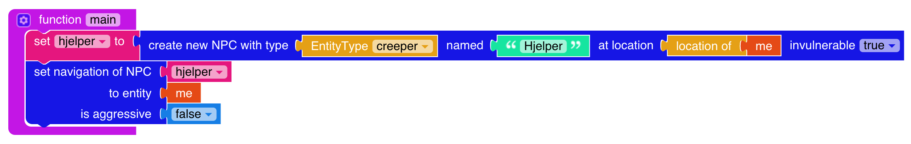
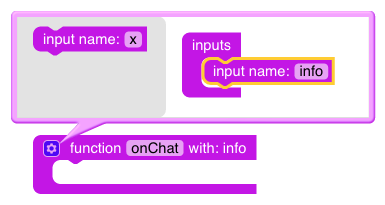
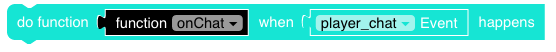
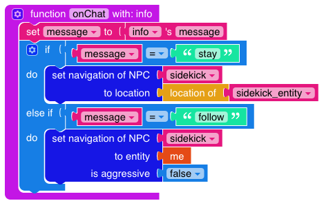
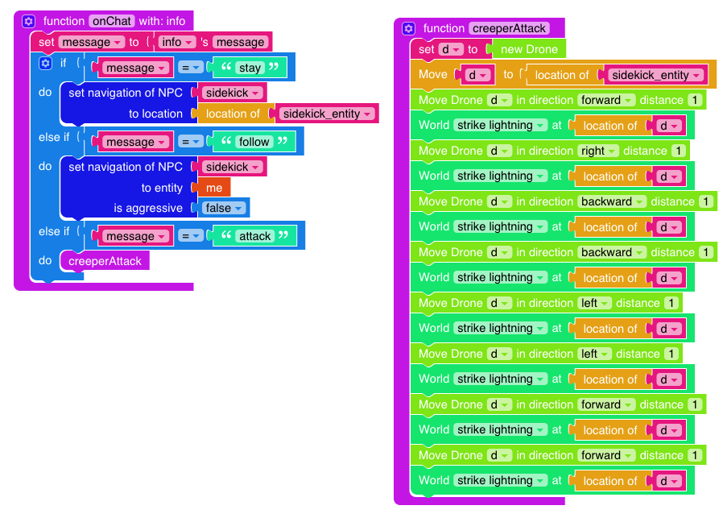
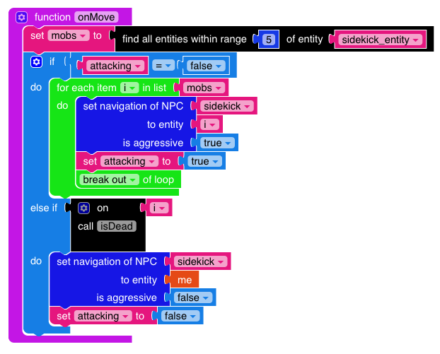
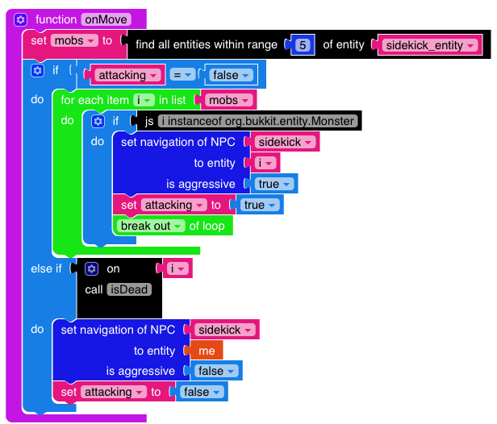

# Sidekick
Denne oppgaven går ut på å lage en hjelper eller sidekick som kan følge etter
oss og angripe fiender. 

# Steg 1: Lag en hjelper som følger etter deg. 
Bruk en variabel `sidekick` hvor du lagrer en ny creeper. Du kan kalle den hva du
vil. Med `sidekick`-variablen kan du sette at den skal følge etter deg. Husk å
velg `false` under `is agressive`. 



# Steg 2: Få hjelperen til å bli igjen når du ber han om det
Vi trenger en ny variabel `sidekick_entity` til å holde styr på hvor hjelperen
vår er. Denne variablen setter vi til `sidekick`-variablen sin entity. Entityen
inneholder informasjon om hvor i Minecraft hjelperen er. Sett denne et sted i
`main`-funksjonen vår. 


Vi trenger også en ny
funksjon som skal kjøre hver gang spilleren skriver noe. Vi kaller denne
funksjonen `onChat` siden den skal kjøre når noen chatter. Husk at  `onChat`
funksjonen skal ha en `with info` i kodeblokken. Dette betyr at funksjonen
kjører med en `info`-variabel satt. Denne variablen inneholder informasjon om
f.eks hvilken melding som ble sendt. På bildet under vises hvordan vi får frem
`with: info` i kodeblokka.



Denne koden skal kjøre når `player chat` eventen kjøres, så vi legger kodeblokka
under inn i main-funksjonen. 



Utvid koden med en if-test som sjekker om meldinga som ble sendt var `stay`.
Hvis meldingen er `stay` vil vi at hjelperen stopper opp til vi sier i fra. 


# Steg 3: Få hjelperen til å følge etter igjen når du ber han om det
Utvid if-testen med en sjekk om du skriver `follow`. 

 

# Steg 4: Hjelperen kan angripe! 
Utvid if-testen med en sjekk om du skriver `attack`. Hvis du gjør det vil vi at
den skal slå ned lyn rundt creeperen. 

 

# Steg 5: La oss gjøre hjelperen litt finere! 

Gå til mod.learntomod.com, Play > Texture Packs > Lag ny (HUSK NAVNET!) > See Inside > Change >
Søk etter creeper > Klikk på Creeper > Gjør endringer > Commit Changes > Close >
Deploy > Vent litt.... > Refresh sida. 

Legg til klossen under i main-funksjonen. Husk å bytte ut url-feltet med navnet
på din texture pack. 

 

# Steg 6: Hjelperen angriper fiender! 
Nå trenger vi litt kode for  å gjøre hjelperen smartere! Vi har lyst til at han
skal angripe mobs som kommer nært oss! Lag en funksjon `onMove` og legg til at
den skal kjøre hver gang spilleren beveger seg. 

 

# Steg 7: Få hjelperen til å kun angripe monstre! 
Det siste er å kun få hjelperen til å angripe monstre. Her finnes det dessverre
ikke noen blokker, så vi trenger litt JavaScript! For hver entity i for-løkka
vår må vi sjekke om det er et Monster eller ikke. Hvis det er et monster kan vi
angripe det! Hvis ikke det er et monster lar vi det være i fred. Husk at en
entity kan også være et item.

```
i instanceof org.bukkit.entity.Monster
``` 


 


# Steg 8: Utvid hjelperen! 
